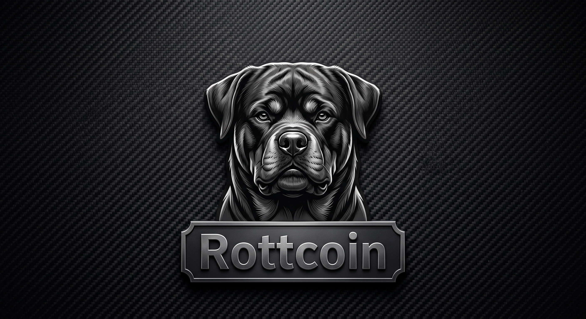

# Rottcoin

## Arquitectura Principal
Rottcoin es una blockchain de Prueba de Trabajo (PoW) implementada en Python. El proyecto demuestra principios criptográficos, mecánica de libro mayor descentralizado y validación de transacciones.

### Módulos
* **`block.py`**: Define la clase `Block`. El módulo maneja el algoritmo SHA-256 y los mecanismos de minería de Prueba de Trabajo (PoW).
* **`blockchain.py`**: Gestiona el estado de la cadena. El sistema orquesta el bloque génesis, el mempool (transacciones pendientes), las recompensas de minería y la validación criptográfica de la red.
* **`wallet.py`**: Asegura las identidades. El componente emplea criptografía de curva elíptica (secp256k1 vía `ecdsa`) para la generación de pares de claves y la firma de transacciones.
* **`main2.py`**: El entorno de ejecución activo. El script demuestra la creación de billeteras, la firma de transacciones, la minería de bloques y la lógica de validación general.
* **`main.py`**: Script heredado. Su uso está descontinuado.

## Requisitos del Entorno
El sistema requiere la instalación de la biblioteca `ecdsa` para ejecutar las operaciones criptográficas.

## Ejecución
La demostración del ciclo de vida de la red y la minería se observa al ejecutar el archivo `main2.py` en un entorno Python configurado.
